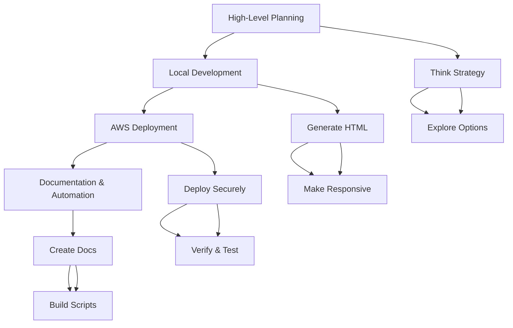

# Vibe Coding a Resume Site with Amazon Q: Complete Guide

## Table of Contents

- [What is Vibe Coding?](#what-is-vibe-coding)
  - [The Vibe Coding Workflow](#the-vibe-coding-workflow)
- [Prerequisites](#prerequisites)
- [Quick Start (5 Minutes)](#quick-start-5-minutes)
- [Getting Started: Download the Scaffold Repository](#getting-started-download-the-scaffold-repository)
  - [Step 1: Clone the Repository](#step-1-clone-the-repository)
  - [Step 2: Understand the Project Structure](#step-2-understand-the-project-structure)
  - [Step 3: Prepare Your Content](#step-3-prepare-your-content)
- [Phase 1: High-Level Planning (The Foundation)](#phase-1-high-level-planning-the-foundation)
  - [Step 1: Start with Strategic Thinking](#step-1-start-with-strategic-thinking)
  - [Step 2: Explore AWS Deployment Options](#step-2-explore-aws-deployment-options)
- [Phase 2: Local Development with Amazon Q CLI](#phase-2-local-development-with-amazon-q-cli)
  - [Step 4: Start Amazon Q CLI Session](#step-4-start-amazon-q-cli-session)
  - [Step 5: Generate the HTML Resume](#step-5-generate-the-html-resume)
  - [Step 6: Make It Responsive](#step-6-make-it-responsive)
- [Phase 3: AWS Deployment](#phase-3-aws-deployment)
  - [Step 7: Deploy to AWS with Security Best Practices](#step-7-deploy-to-aws-with-security-best-practices)
  - [Step 8: Verify Deployment](#step-8-verify-deployment)
- [Phase 4: Documentation and Automation](#phase-4-documentation-and-automation)
  - [Step 9: Generate Project Documentation](#step-9-generate-project-documentation)
  - [Step 10: Create Update Scripts](#step-10-create-update-scripts)
- [Essential Amazon Q CLI Commands](#essential-amazon-q-cli-commands)
- [Practical Vibe Coding Examples](#practical-vibe-coding-examples)
- [Best Practices for Vibe Coding with Amazon Q](#best-practices-for-vibe-coding-with-amazon-q)
  - [The Phase Approach (Core Methodology)](#the-phase-approach-core-methodology)
  - [Amazon Q CLI Best Practices (Official AWS Guidance)](#amazon-q-cli-best-practices-official-aws-guidance)
  - [Vibe Coding Specific Tips](#vibe-coding-specific-tips)
  - [Security Considerations](#security-considerations)
  - [When Vibe Coding Works Best](#when-vibe-coding-works-best)
  - [Common Pitfalls to Avoid](#common-pitfalls-to-avoid)
  - [Advanced Vibe Coding Techniques](#advanced-vibe-coding-techniques)
  - [Troubleshooting Common Issues](#troubleshooting-common-issues)
  - [Performance and Cost Optimization](#performance-and-cost-optimization)
- [Troubleshooting](#troubleshooting)
- [Advanced Tips](#advanced-tips)
- [Conclusion](#conclusion)
  - [Success Checklist](#success-checklist)
  - [What's Next?](#whats-next)
- [Resources](#resources)

---

## What is Vibe Coding?

Vibe coding is an approach where you let AI take the lead in development decisions. Instead of micromanaging every detail, you provide high-level guidance and "go with the vibes" - letting the AI suggest solutions and clicking "yes" to let it build out ideas organically. It's like improvisational jazz for coding.

### The Vibe Coding Workflow



## Prerequisites

- AWS CLI configured with appropriate permissions
- Amazon Q Developer CLI installed (`q` command)
- Basic understanding of web development concepts
- Git installed on your system

## Quick Start (5 Minutes)

**Want to see vibe coding in action immediately?** Follow these steps:

1. **Clone and navigate**: `git clone https://github.com/labeveryday/vibe-coding-resume-site.git && cd vibe-coding-resume-site`
2. **Start Q CLI**: `q chat`
3. **Vibe code your site**: Paste this prompt:
   ```
   I have a resume.md file in the resume/ folder and images in the images/ folder. 
   Create a professional HTML resume website using this content.
   ```
4. **Make it responsive**: `Make this website responsive for mobile devices`
5. **Deploy to AWS**: `Deploy this to AWS with a private S3 bucket and CloudFront`

**Result**: You'll have a live resume website in under 5 minutes! Then read the full guide to understand the methodology.

---

## Getting Started: Download the Scaffold Repository

### Step 1: Clone the Repository

First, download this scaffold repository to get started:

```bash
git clone https://github.com/labeveryday/vibe-coding-resume-site.git
cd vibe-coding-resume-site
```

### Step 2: Understand the Project Structure

The repository comes with a pre-organized structure:

```
vibe-coding-resume-site/
├── resume/
│   └── resume.md              # Template resume with examples ✅
├── images/
│   ├── profile.png            # Example professional headshot ✅
│   ├── certifications/        # Example AWS certification badges ✅
│   │   ├── badge-aws-saa.png
│   │   ├── AWS-Certified-Cloud-Practitioner.png
│   │   └── AWS-Certified-AI-Practitioner.png
│   └── README.md             # Detailed image guidelines
├── transcript/
│   └── vibe_coding.txt       # Live coding session transcript
└── README.md                 # This complete guide
```

### Step 3: Prepare Your Content

#### Add Your Resume Content

Edit the `resume/resume.md` file with your information:

```markdown
# Your Name
## Contact Information
- Email: your.email@example.com
- LinkedIn: linkedin.com/in/yourprofile
- Location: Your City, State

## Top Skills
- Skill 1
- Skill 2
- Skill 3

## Experience
### Job Title - Company Name
*Dates*
- Achievement 1
- Achievement 2

## Certifications
- Certification 1
- Certification 2
```

#### Add Your Images

1. **Profile Image**: Add your LinkedIn profile image to `images/profile.png` (or .jpg)
2. **Certification Images**: Add any certification badges or images to `images/certifications/`
   - AWS certifications
   - Microsoft certifications
   - Google Cloud certifications
   - Any other professional certifications

**Image Guidelines:**
- Profile image should be professional (LinkedIn-style headshot)
- Certification images should be official badges/logos
- Recommended formats: JPG, PNG
- Keep file sizes reasonable (under 1MB each)

## Phase 1: High-Level Planning (The Foundation)

### Step 1: Start with Strategic Thinking

Before writing any code, use Claude or another AI to think through your project at a high level:

```
I want to develop a resume website on AWS, but I have never done it before. 
Can you help me think about what I need to do to make this happen? 
I want it to look great and be responsive. 
Let's think step by step with no code, high level.
```

This gives you:
- Planning phase considerations
- Hosting options on AWS
- Design and responsiveness requirements
- Content structure planning
- Development approach options
- AWS services to consider
- Deployment strategies
- SEO optimization thoughts

### Step 2: Explore AWS Deployment Options

Ask for AWS-specific guidance:

```
Create a website on AWS
```

The AI will typically suggest multiple approaches:
1. **Simple S3 Static Website** - Basic hosting
2. **S3 + CloudFront** - Better performance with CDN
3. **S3 + CloudFront + Route 53** - Custom domain support
4. **EC2 Instance** - Full server control
5. **AWS Amplify** - Automated deployment from Git

Choose based on your needs (S3 + CloudFront is recommended for most resume sites).

## Phase 2: Local Development with Amazon Q CLI

### Step 4: Start Amazon Q CLI Session

Now that you're in your project directory, start the Amazon Q CLI session:

```bash
q chat
```

**Pro Tips for Q CLI:**
- Type `/quit` to exit the chat session
- Use `Ctrl+D` as an alternative to quit
- Q CLI provides contextual understanding of your project files
- The CLI integrates with your local file system and can read/write files

### Step 5: Generate the HTML Resume

Use this vibe coding prompt:

```
I have a resume.md file in the resume/ folder that I want to make into an HTML resume page. 
I also have images in the images/ folder including my profile image and certification badges. 
Use this info to build a professional resume website.
```

Amazon Q will:
- Analyze your resume.md file in the resume/ folder
- Find and analyze your profile image in images/
- Discover certification images in images/certifications/
- Create a modern, professional HTML page
- Include CSS styling for a polished look
- Integrate your profile image and certification badges
- Structure the content professionally

**Vibe Coding Tip**: Don't micromanage the design decisions. Let Q choose colors, layouts, and styling. You can always refine later.

### Step 6: Make It Responsive

After the initial site is created, ask:

```
Make this website responsive for mobile devices
```

Q will update the HTML/CSS to ensure it looks good on:
- Desktop browsers
- Tablets  
- Mobile phones
- Various screen sizes

**Vibe Coding Tip**: Test the responsiveness by opening developer tools in your browser and switching to mobile view.

## Phase 3: AWS Deployment

### Step 7: Deploy to AWS with Security Best Practices

Use this prompt for secure deployment:

```
I want to deploy this to AWS, but I do not want a public S3 bucket. 
I want everything to be secure and we can leverage CloudFront.
```

Amazon Q will:
- Create a private S3 bucket with all public access blocked
- Set up CloudFront distribution for global content delivery
- Configure Origin Access Control (OAC) for secure S3 access
- Create appropriate bucket policies allowing only CloudFront access
- Set up HTTPS enforcement and security headers
- Configure the most cost-effective settings

**Security Features Implemented:**
- Private S3 bucket (no direct public access)
- Origin Access Control (OAC) instead of legacy OAI
- HTTPS enforcement
- Restricted bucket policies
- CloudFront security headers

**Vibe Coding Tip**: Trust Q's security recommendations. It follows AWS best practices automatically.

### Step 8: Verify Deployment

Q will provide:
- CloudFront distribution URL
- Deployment confirmation
- Security configuration details
- Cost estimates (typically under $0.25/month)

## Phase 4: Documentation and Automation

### Step 9: Generate Project Documentation

Ask Q to create comprehensive documentation:

```
Create a detailed README of everything we have done to create the site and deploy it to AWS. 
Include Mermaid diagrams.
```

This creates:
- Project overview
- Architecture diagrams (Mermaid format)
- Step-by-step deployment process
- Security considerations
- Cost analysis
- Update procedures

### Step 10: Create Update Scripts

Automate future updates:

```
Create a PowerShell script that will automatically update the site and invalidate CloudFront once it does.
```

Q will generate scripts for:
- Uploading files to S3 using AWS PowerShell modules
- CloudFront cache invalidation
- Error handling and progress reporting
- Parameter validation

**Alternative Scripts**: You can also ask for bash scripts, Python scripts, or other automation tools.

## Essential Amazon Q CLI Commands

### Basic Commands
```bash
# Start a chat session
q chat

# Exit chat session
/quit
# or
Ctrl+D

# Get help
q --help

# Check version
q --version
```

### Advanced Features
- **Git-aware file selection**: Q understands your Git repository structure
- **Context management**: Q maintains context across your project files
- **Natural language to shell commands**: Ask Q to generate shell commands
- **Inline completions**: Q provides suggestions as you type in supported terminals

## Practical Vibe Coding Examples

### Example 1: Adding a Contact Form
```
Add a contact form to my resume website that sends emails using AWS SES. 
Make it secure and include form validation.
```

### Example 2: Adding Analytics
```
Add Google Analytics to track visitors to my resume site. 
Include privacy-compliant tracking and GDPR considerations.
```

### Example 3: Custom Domain Setup
```
Help me set up a custom domain for my resume site using Route 53. 
I want to use [yourdomain.com] and ensure SSL certificates are properly configured.
```

### Example 4: Performance Optimization
```
Optimize my resume website for faster loading. 
Include image compression, CSS minification, and caching strategies.
```

### Example 5: Adding a Blog Section
```
Add a blog section to my resume website where I can write technical articles. 
Use a simple file-based approach that's easy to maintain.
```

### Example 6: Multi-language Support
```
Make my resume website support both English and Spanish. 
Add language switching functionality and translate the content.
```

## Best Practices for Vibe Coding with Amazon Q

### The Phase Approach (Core Methodology)

1. **Plan First**: Always start with high-level thinking before writing code
2. **Build in Chunks**: Don't try to do everything at once ("don't eat the whole elephant")
3. **Document Each Phase**: Create README files after each major step
4. **Commit Frequently**: Use Git to track changes and create restore points
5. **Review Before Accepting**: Understand what the AI is doing, don't blindly click "yes"

### Amazon Q CLI Best Practices (Official AWS Guidance)

#### Providing Context for Better Results
- **Start with existing code**: Create file structures, import libraries, or establish code skeletons
- **Include relevant imports**: Add libraries that are relevant to your project's objectives
- **Maintain clear focus**: Keep your project focused on specific objectives
- **Use descriptive file names**: Help Q understand the purpose of each file

#### Effective Prompting Techniques
- **Be specific in prompts**: Provide details instead of generalizations
- **Use natural language**: Describe what you want in plain English
- **Experiment with different approaches**: Try various prompt styles to get better results
- **Use standard comment blocks**: Write clear comments to guide code generation

#### Working with Amazon Q CLI Chat
- **Start chat sessions**: Use `q chat` to begin interactive sessions
- **Ask for assistance**: If inline suggestions aren't working, chat with Q for guidance
- **Request code snippets**: Ask for specific functions or classes to kickstart your context
- **Exit gracefully**: Type `/quit` or press Ctrl+D to end chat sessions

### Vibe Coding Specific Tips

#### The "Go with the Vibes" Philosophy
- **Trust the AI's decisions**: Let Q make design choices rather than micromanaging
- **Accept suggestions**: Click "yes" to AI suggestions unless you have specific concerns
- **Embrace iteration**: Let the AI build, then refine in subsequent steps
- **Stay flexible**: Be open to approaches you hadn't considered

#### Effective Vibe Coding Prompts
```bash
# High-level planning (start here)
"I want to create [project type]. Let's think step by step with no code, high level."

# Building phase
"I have [files/content] that I want to turn into [desired outcome]. Use this info to build [specific request]."

# Enhancement phase  
"Make this [improvement request - responsive, secure, etc.]"

# Deployment phase
"Deploy this to AWS, but I want [specific requirements - security, cost optimization, etc.]"

# Documentation phase
"Create a detailed README of everything we have done. Include diagrams."
```

#### Managing Complexity
- **One feature at a time**: Add functionality incrementally
- **Test after each phase**: Verify each step works before moving on
- **Create checkpoints**: Commit code after each successful phase
- **Break down large requests**: Split complex tasks into smaller, manageable pieces

### Security Considerations

#### Built-in Security Features
- **Use Q Developer's security scanner**: Run automatic security scans on generated code
- **Enable security checks**: Configure Q to consider security in code generation
- **Review security recommendations**: Pay attention to Q's security suggestions

#### AWS Security Best Practices
- **Never use public S3 buckets**: Always use private buckets with CloudFront
- **Implement proper IAM policies**: Use least-privilege access principles
- **Enable HTTPS**: Force secure connections for all web traffic
- **Use Origin Access Control**: Secure CloudFront to S3 connections
- **Enable security headers**: Configure CloudFront security headers

### When Vibe Coding Works Best

✅ **Ideal for:**
- **Rapid prototyping**: Getting ideas to working code quickly
- **Learning new technologies**: Exploring unfamiliar frameworks or services
- **Building MVPs**: Creating minimum viable products for testing
- **Exploring different approaches**: Trying multiple solutions to find the best fit
- **Getting unstuck**: Breaking through development roadblocks
- **Documentation generation**: Creating comprehensive project documentation
- **Infrastructure as Code**: Setting up AWS resources and configurations

❌ **Not ideal for:**
- **Complex enterprise applications**: Multi-team, large-scale systems
- **Specific architectural patterns**: When you need exact implementation patterns
- **Mission-critical production systems**: Without thorough review and testing
- **Highly regulated environments**: Where every line of code must be audited
- **Performance-critical applications**: Where optimization is paramount

### Common Pitfalls to Avoid

#### Development Pitfalls
1. **Eating the Whole Elephant**: Trying to build everything in one go
2. **Blind Acceptance**: Clicking "yes" without understanding the changes
3. **Skipping Documentation**: Not documenting what was built and how
4. **Ignoring Security**: Not running security scans or following best practices
5. **No Version Control**: Not committing changes frequently enough

#### Amazon Q Specific Pitfalls
1. **Insufficient Context**: Not providing enough information for Q to understand your goals
2. **Vague Prompts**: Using unclear or overly general requests
3. **Ignoring Suggestions**: Not leveraging Q's recommendations and alternatives
4. **Context Overload**: Providing too much irrelevant information that confuses Q
5. **Not Iterating**: Expecting perfect results on the first try

### Advanced Vibe Coding Techniques

#### Context Management
- **Use Git-aware file selection**: Q can understand your Git repository structure
- **Leverage context hooks**: Set up automatic context for different project types
- **Manage profiles**: Create different Q profiles for different types of projects
- **Provide relevant examples**: Include sample code or configurations Q can reference

#### Optimization Strategies
- **Start broad, then narrow**: Begin with general requirements, then add specifics
- **Use Q's reasoning**: Take advantage of Q's step-by-step thinking process
- **Combine tools**: Use Claude for planning, Q CLI for implementation
- **Leverage existing patterns**: Reference successful patterns from previous projects

#### Collaboration Tips
- **Document decisions**: Record why certain approaches were chosen
- **Share context**: Help team members understand the AI-generated code
- **Create templates**: Save successful vibe coding patterns for reuse
- **Establish standards**: Define coding standards that Q should follow

### Troubleshooting Common Issues

#### When Q Doesn't Understand
- **Provide more context**: Add relevant files, comments, or examples
- **Break down the request**: Split complex tasks into smaller parts
- **Use different phrasing**: Try alternative ways to describe your needs
- **Reference documentation**: Point Q to relevant official documentation

#### When Results Aren't What You Expected
- **Iterate and refine**: Use follow-up prompts to adjust the output
- **Provide feedback**: Tell Q what's wrong and what you want instead
- **Start over if needed**: Sometimes a fresh start with better context works better
- **Combine approaches**: Mix AI-generated code with manual adjustments

### Performance and Cost Optimization

#### AWS Cost Management
- **Use appropriate service tiers**: Choose cost-effective AWS services for your use case
- **Monitor usage**: Set up billing alerts and cost monitoring
- **Optimize CloudFront**: Use appropriate price classes and caching strategies
- **Right-size resources**: Don't over-provision AWS resources

#### Development Efficiency
- **Reuse successful patterns**: Save and reuse effective prompts and approaches
- **Build incrementally**: Add features one at a time to avoid rework
- **Test continuously**: Verify functionality at each step
- **Document as you go**: Create documentation during development, not after

## Troubleshooting

### When Things Go Wrong

- **Break down the problem**: Ask Q to solve smaller pieces
- **Provide context**: Share error messages and logs
- **Reference documentation**: Ask Q to analyze official docs
- **Iterate**: Don't expect perfection on the first try

### Getting Better Results

- Be specific about requirements (responsive, secure, etc.)
- Provide examples of what you want
- Ask for explanations of the generated code
- Request multiple approaches when unsure

## Advanced Tips

### Enhancing Your Vibe Coding

1. **Use Multiple AI Tools**: Start with Claude for planning, then use Q CLI for implementation
2. **Leverage Context**: Q CLI can access your local files and system
3. **Create Templates**: Save successful patterns for future projects
4. **Build Incrementally**: Add features one at a time
5. **Test Continuously**: Verify each change works before moving on

### Cost Optimization

- Use CloudFront Price Class 100 for lowest cost
- Enable caching to reduce requests
- Monitor usage with AWS Cost Explorer
- Set up billing alerts

## Conclusion

Vibe coding with Amazon Q enables rapid development from idea to deployed application. The key is balancing AI automation with human oversight, breaking complex tasks into manageable phases, and maintaining good development practices throughout the process.

Remember: The goal isn't to replace your development skills, but to augment them and enable faster iteration on ideas. Always understand what the AI is building and maintain security best practices.

### Success Checklist

By the end of this guide, you should have:

- ✅ **A live resume website** hosted on AWS
- ✅ **Secure architecture** with private S3 bucket and CloudFront
- ✅ **Responsive design** that works on all devices
- ✅ **Professional appearance** with your content and images
- ✅ **Complete documentation** of your build process
- ✅ **Automation scripts** for future updates
- ✅ **Understanding** of the vibe coding methodology
- ✅ **Cost-effective hosting** under $0.25/month

### What's Next?

- **Customize further**: Add contact forms, analytics, or blog sections
- **Set up custom domain**: Use Route 53 for professional URLs
- **Optimize performance**: Implement advanced caching and compression
- **Share your experience**: Help others learn vibe coding
- **Build more projects**: Apply vibe coding to other development challenges

## Resources

- [Amazon Q Developer Documentation](https://docs.aws.amazon.com/amazonq/)
- [AWS Static Website Hosting Guide](https://docs.aws.amazon.com/AmazonS3/latest/userguide/WebsiteHosting.html)
- [CloudFront Documentation](https://docs.aws.amazon.com/cloudfront/)
- [AWS Pricing Calculator](https://calculator.aws)

---

*This guide is based on a live coding session demonstrating the vibe coding approach with Amazon Q Developer CLI.*
